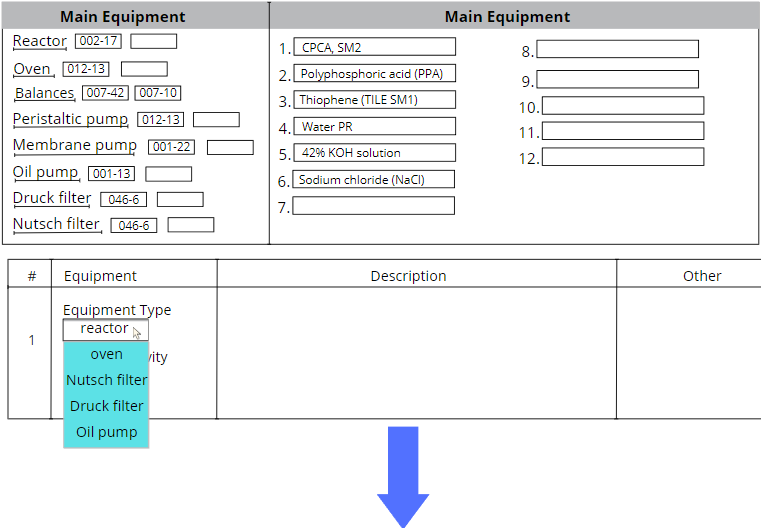
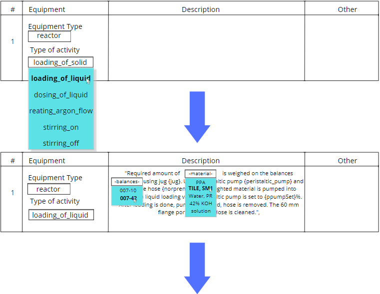

# BR_Generator

## Overview
This application is designed to facilitate the creation of batch records for operators in pharmaceutical manufacturing. It provides a structured table format where user can input sequential operational details, equipment selections, process descriptions, and record actual data.

## Features
*User*
- Core features:
1. Select all equipment, utensils, and materials that are used in one technological process. Select their codes. This selection will be saved and fetched to the user every time he wants to create new operation. This will exclude the possibility of using the wrong code of equipment in operation.
2. Create a Batch Record - a sequence of operations that will include selected equipment, materials, and utensils.
3. 
- Additional features:
1. Possibility to add, edit, delete operations.
2. Change equipment code, and equipment type in any operation. Once the code is changed, it will be refreshed in all other operations, keeping the whole Batch Record more coherent. 

*Moderator*
1. Update, edit or delete core content of operaions.

## User Stories or Use Cases

- **User Story 1:** 
  - **As a user**, I want to be able to log in to the application using my email and password.
  - **Acceptance Criteria:**
    - There should be a simple login page with fields for email and password.
    - Users should have the option to create a new account if they don't have one.
    - After successful login, the user should be redirected to the creation page.

- **User Story 2:** 
  - **As a user**, I want to create a batch record for a production process in pharmaceutical manufacturing.
  - **Acceptance Criteria:**
    - The creation page should provide a structured table format for inputting project and process-related data.
    - Users should be able to select the main equipment, TP (technological process), and input main materials for the batch record.
    - The table should include columns for sequential numbering of operations, equipment and activity type selection, description, and fields for recording actual data.

- **User Story 3:** 
  - **As a user**, I want to select equipment, utensils, and materials used in one technological process and save them for future use.
  - **Acceptance Criteria:**
    - Users should have the option to select and save all equipment, utensils, and materials along with their codes for a particular process.
    - This selection should be saved and fetched for the user every time they create a new operation to prevent the use of incorrect equipment codes.

- **User Story 4:** 
  - **As a user**, I want to be able to add, edit, or delete operations in a batch record.
  - **Acceptance Criteria:**
    - Users should have the option to add, edit, or delete operations within a batch record.
    - Changes made to equipment codes or types should reflect in all other operations to maintain coherence in the batch record.

- **User Story 5:** 
  - **As a moderator**, I want to update, edit, or delete core content of operations.
  - **Acceptance Criteria:**
    - Moderators should have the ability to update, edit, or delete the core content of operations within a batch record.

### Dependencies

1. **Database Management**
   - The application relies on a database to store user accounts, batch records, equipment, utensils, and materials data.
   - Proper database management and integration are essential for the functioning of the application.

2. **User Interface Design**
   - The user interface should be intuitive and user-friendly to facilitate seamless navigation and interaction with the application.
   - Design considerations should prioritize ease of use and accessibility for all users.

3. **Security Measures**
   - Robust security measures should be implemented to protect user data, prevent unauthorized access, and ensure compliance with regulatory requirements in pharmaceutical manufacturing.

## Wireframes or Mockups

## Data Model and Database Schema
- Overview of the data model, including entities, attributes, and relationships.
- Database schema design based on the data model.

## Technology Stack
- Frontend and backend technologies and frameworks.
- Considerations for compatibility, scalability, and team expertise.

## Architecture Design
- Overall architecture of the web application.
- Interaction between different components.

## Timeline and Milestones
- Phases of the project with deadlines and milestones.
- Design, development, testing, and deployment timeline.

## Risk Assessment and Mitigation
- Potential risks and challenges.
- Strategies to mitigate risks and contingencies.

## Installation and Usage
Instructions for setting up and running the project locally.

## Contribution Guidelines
Guidelines for contributing to the project, including coding standards and how to submit pull requests.

## License
Information about the project's license and usage rights.

## Credits
Acknowledgments for any contributors, libraries, or resources used in the project.
