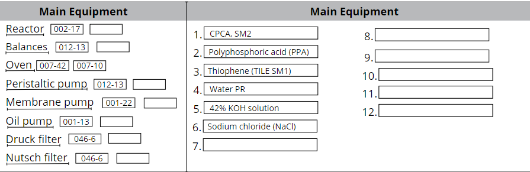

# BR_Generator

## NB! README from API Server!
apiServerJava\README.md

## Running the Application
To run the application locally, follow these steps:

1. **Install Node.js and npm**: If you haven't already, install Node.js and npm (Node Package Manager) from the official Node.js website: [https://nodejs.org](https://nodejs.org).

2. **Clone the Repository**: Clone the repository containing the proxy server code to your local machine using Git:
   ```bash
   git clone https://github.com/TartuDen/BMR_Generator```
   

3. **Navigate to the Project Directory**: Change your current directory to the project directory:
    ```bash
    cd <project_directory>```

4. **Install Dependencies**: Use npm to install the required dependencies specified in the package.json file:
    ```bash
    npm install```
5. **Start the Server**: Start the Express server using the following command:
    ```bash
    node index.js```


## Overview

[OpenAPI Specification](https://app.swaggerhub.com/apis/YuriiPanasuk/br_Generator/0.0.5)

This application is designed to facilitate the creation of batch records for production in GMP pharmaceutical manufacturing. 
It consists of **login page**, and **creation page**.
On the login page, the user can enter the login and password. Or create a new user.
After login, the user is redirected to the creation page.
The creation page has a table.
A table header is where the user inputs project and process related data, like:
1. Project name.
2. TP (technological process) of the current batch record.
3. Select the main equipment for the given process, from the equipment list. Such as a reactor, oven, and filter.
4. Inputs main materials that are going into the process.  For example: EtNH2;

## Login page
Simple login page with email and password

## Creation page

### Table Structure

###*Header*
On the header of the table we have different section for different type of equipment, for example 2 drop down lists for reactors, 2 dd lists for pumps, 2 dd lists for balances.

###*Creation part*

The batch record table consists of the following columns:
1. **Sequential Number**: Sequential numbering of operations.
2. **Equipment and Activity Type**: Selection of equipment for the operation along with its code. Based on equipment selected, second drop down list is populated with relative operations for this equipment.
3. **Description**: main equipment and acitvity type are selected, description will be loaded from the data base. The description has specail placeholders for selection additional data, like <additional equipment>, <setting for equipment>, <material that is used in operation>;
4. **Other**: Empty fields for operators to record actual data.

## Equipment Types

The application supports various equipment types commonly used in pharmaceutical manufacturing, including:

- Reactor
- Oven
- Peristaltic Pump
- Membrane Pump
- Oil Pump
- Druck Filter
- Nutsch Filter
- Balances

## User case example.

### Header
After login, on the top of page have header section of the table. Header consists of 2 columns:


**Main Equipment**
1. **Reactor** drop-down list we select reactor 002-17; Second reactor in second dd list will remain empty, our process requires only one reactor.
2. **Oven** - 012-13
3. **Balances** - 007-42 and 007-10;
4. **Peristaltic pump** - 001-13;
5. **Membrane Pump** - 001-22;

**Materials**
1. In empty fields type names of the reagents / starting materials or solvents.

### Body part
Below the header we have a body part, it is one row that has 3 columns:
**Sequence number**
**Equipment**
has 2 drop-down menus:
1. Equipment type - selecting among main equipment.
2. Type of Activity - based on selected equipment, populates with specific types of operations.
**Description** - After selecting the Equipment type and Type of activity, this cell will be populated with the respective operations.
**Other** - there will be placeholders for recording actual data during the operation.

Here's an example of how the process description is structured:

- **Equipment Type**: Reactor
  - **Equipment Code**: 002-10
    - **Type of Activity**: Loading of Solid
        **Description**:
            The required amount of {select material} is weighed on the balances {select balances} using jug {jug}.
            Material is loaded into reactor {select reactor} via 60 mm flange port using funnel {select funnel}.
            The 60 mm flange port is closed.
            ***NB! In the description, variables within curly braces {} indicate placeholders for specific details that need to be filled in by the operator, such as materials, balances, jug, and funnel.***
- Press **Save** and operation, together with sequence code, all relevant equipment, utensils and material used in operation will be saved in a struct.
